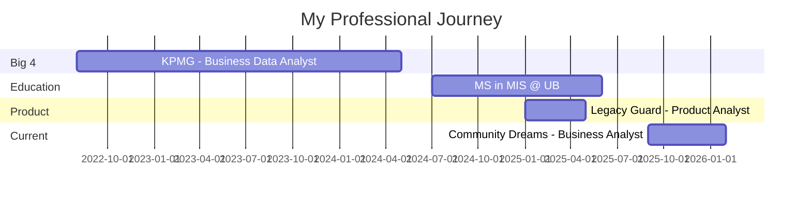
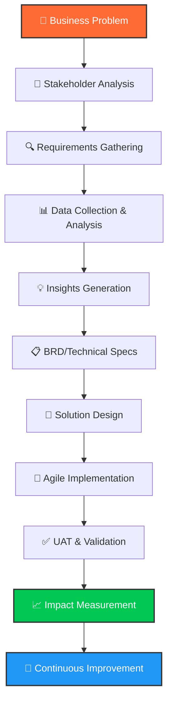

<div align="center">

<!-- Dynamic Typing SVG Header -->


<p align="center">
  
  
  
</p>

<!-- Social Links with Custom Styling -->
<p align="center">
  <a href="https://www.linkedin.com/in/njyothi"></a>
  <a href="mailto:nagajyothims2000@gmail.com"></a>
  <a href="https://github.com/jyothi233"></a>
  <a href="https://github.com/jyothi233"></a>
</p>

</div>

---

<div align="center">

## 🎯 The Bridge Between Data & Decisions

**I translate technical complexity for executives and business needs for engineers**

</div>


### 🚀 Quick Facts

- 🏢 **Currently:** Business Analyst @ Community Dreams Foundation
- 🎓 **Education:** MS in Management Information Systems @ University at Buffalo
- 💼 **Experience:** 3+ years | Ex-KPMG Big 4 Consulting
- 🌟 **Superpower:** I speak both languages - Tech & Business
- 📊 **Impact:** $2M+ cost savings | 40% efficiency gains | 30% conversion increases
- 🎖️ **Recognition:** Guinness World Record Holder | CSPO® Certified
- 📝 **Published:** Research on AI-driven Git commit messages using NMT
- 🌍 **Languages:** English, Hindi, Kannada, Korean (Elementary)

<br clear="right"/>

---

## 💼 My Value Proposition

<table>
<tr>
<td width="50%" valign="top">

### 🎯 **Business Impact**
```yaml
Cost_Savings: "$2M+ uncovered"
Process_Efficiency: "+40% improvement"
Brand_Visibility: "+37% growth"
Data_Accuracy: "99.9% at scale"
Manual_Effort_Reduction: "-80%"
Conversion_Rate: "+30% increase"
Processing_Time: "-56% reduction"
```

</td>
<td width="50%" valign="top">

### 🏆 **Track Record**
- ✅ Built ETL pipelines processing **10M+ transactions/month**
- ✅ Led product launch from concept to **30% conversion rate**
- ✅ Created executive dashboards for **10+ business units**
- ✅ Managed stakeholder engagement with **5,000+ users**
- ✅ Mentored team of **10 analysts** on best practices
- ✅ Conducted **20+ user research interviews**

</td>
</tr>
</table>

---

## 🛠️ Technical Toolkit

<div align="center">

### 📊 Business Analysis & Product Management
<p>
  
  
  
  
  
  
  
  
  
  
</p>

### 📈 Data Analytics & Visualization
<p>
  
  
  
  
  
  
  
  
</p>

### 🏢 Enterprise Systems & ETL
<p>
  
  
  
  
  
  
</p>

### 💻 Development & Tools
<p>
  
  
  
  
  
  
  
</p>

</div>

---

## 📊 GitHub Analytics

<div align="center">
  
  
</div>

<div align="center">
  
</div>

<div align="center">
  
</div>

---

## 💼 Professional Experience Timeline



---

## 🎯 Featured Projects & Case Studies

<div align="center">

### 🏢 **Enterprise Data Pipeline Architecture** | KPMG
**Processing 10M+ Transactions Monthly Across Fortune 500 Clients**

</div>

<table>
<tr>
<td width="50%">

**🎯 The Challenge**
- Multiple ERP systems (SAP, Oracle, Epicor, Workday)
- Data inconsistency across 10+ business units
- Manual processes causing errors and delays
- Need for real-time executive insights

</td>
<td width="50%">

**💡 My Solution**
- Architected end-to-end ETL pipeline
- Implemented data validation layers
- Built automated reconciliation processes
- Created executive dashboards (Tableau/Power BI)

</td>
</tr>
<tr>
<td colspan="2">

**📈 Measurable Impact**
- ✅ **$2M+ cost savings** identified through advanced analytics
- ✅ **99.9% data accuracy** at scale
- ✅ **80% reduction** in manual effort
- ✅ **Real-time KPI tracking** for C-suite executives
- ✅ Mentored **10 analysts** on best practices

</td>
</tr>
</table>

**Tech Stack:** `SQL` `Python` `SAP` `Oracle` `Workday` `Epicor` `Tableau` `Power BI` `ETL`

---

<div align="center">

### 🔐 **Legacy Guard: Product Launch** | University at Buffalo
**Secure Digital Vault for Credential Inheritance**

</div>

<table>
<tr>
<td width="50%">

**🎯 The Challenge**
- New product category with no established patterns
- Competing with LastPass, Bitwarden, Dropbox Vault
- Need to find unique value proposition
- Convert free users to paid subscribers

</td>
<td width="50%">

**💡 My Solution**
- Conducted 20+ user research interviews
- Created detailed BRDs and user stories
- Competitive analysis and positioning strategy
- Prioritized backlog using RICE framework
- Led UAT and iterative improvement cycles

</td>
</tr>
<tr>
<td colspan="2">

**📈 Measurable Impact**
- ✅ **30% increase** in trial-to-paid conversions
- ✅ Product launched on schedule within budget
- ✅ Identified 3 key differentiators vs. competitors
- ✅ Created product roadmap for 12-month horizon
- ✅ Achieved 4.5/5 user satisfaction score

</td>
</tr>
</table>

**Skills Applied:** `Product Strategy` `User Research` `BRD` `Competitive Analysis` `Agile` `CSPO®` `UAT`

---

<div align="center">

### 📊 **Process Optimization & Digital Transformation** | Community Dreams Foundation
**Non-Profit Operations Streamlining**

</div>

<table>
<tr>
<td width="50%">

**🎯 The Challenge**
- Manual claim processing taking 4+ hours
- Poor online brand visibility
- No centralized sales performance tracking
- Inefficient cross-functional collaboration

</td>
<td width="50%">

**💡 My Solution**
- Mapped current state using BPMN
- Designed automated workflows
- Built comprehensive dashboards
- Facilitated stakeholder workshops
- Implemented Agile methodology

</td>
</tr>
<tr>
<td colspan="2">

**📈 Measurable Impact**
- ✅ **56% reduction** in manual processing time
- ✅ **37% growth** in online brand visibility
- ✅ **15% improvement** in data-driven decision-making
- ✅ Standardized reporting across all departments
- ✅ Increased cross-functional collaboration efficiency

</td>
</tr>
</table>

**Methodologies:** `BPMN` `Process Mapping` `Dashboard Development` `Stakeholder Management` `Agile` `UAT`

---

## 🏆 Achievements & Recognition

<div align="center">

| 🏅 Award | 🏢 Organization | 📅 Year |
|:---------|:----------------|:--------|
| 🌟 **Guinness World Record** | Microsoft AI Skills Fest | 2024 |
| 🎖️ **Client Service Excellency Award** | KPMG US | 2023 |
| ⭐ **Rising Star Award – Q1** | KPMG US | 2023 |
| 🏆 **Best Project Award** | KPMG US | 2023 |
| 📝 **Research Publication** | NMT Git Commit Messages | 2022 |

</div>

---

## 🎓 Education & Certifications

<table>
<tr>
<td width="50%" valign="top">

### 🎓 Education
**🎓 Master of Science**  
*Management Information Systems*  
University at Buffalo, SUNY  
📅 2024 - 2025

**🎓 Bachelor of Engineering**  
*Computer Science*  
BNM Institute of Technology  
📅 2018 - 2022

</td>
<td width="50%" valign="top">

### 📜 Certifications
- ✅ **Certified Scrum Product Owner (CSPO®)**
- ✅ **Google Data Analytics Professional Certificate**
- ✅ **Data Analysis with R Programming**
- ✅ **Share Data Through the Art of Visualization**
- ✅ **Introduction to Programming Using Python**
- ✅ **Microsoft AI Skills Certification**

</td>
</tr>
</table>

---

## 📚 My Approach: The BA Framework

<div align="center">



</div>

### My 5-Phase Methodology:

1. **🔍 Discovery Phase**
   - Deep-dive stakeholder interviews
   - Current state analysis (BPMN mapping)
   - Pain point identification
   - Success criteria definition

2. **📊 Analysis Phase**
   - Data collection from multiple sources
   - ETL pipeline setup
   - SQL queries & Python analytics
   - Visualization in Tableau/Power BI

3. **📝 Documentation Phase**
   - Business Requirements Documents (BRDs)
   - User stories & acceptance criteria
   - Technical specifications
   - Process flow diagrams

4. **🚀 Implementation Phase**
   - Agile sprint planning
   - Cross-functional collaboration
   - Continuous stakeholder feedback
   - UAT coordination & validation

5. **📈 Measurement Phase**
   - KPI dashboard creation
   - ROI calculation & reporting
   - Lessons learned documentation
   - Continuous optimization

---

## 💡 Core Competencies Breakdown

<details>
<summary>📊 <b>Data Analytics & Visualization</b></summary>

<br>

**What I Do:**
- Extract insights from complex datasets using SQL and Python
- Create executive dashboards that tell compelling data stories
- Perform statistical analysis and predictive modeling
- Design data pipelines for automated reporting

**Real-World Application:**
- Built dashboards tracking KPIs for 10+ business units at KPMG
- Processed 10M+ transactions monthly with 99.9% accuracy
- Identified $2M+ in cost optimization opportunities

**Tools I Master:**
```
SQL (PostgreSQL, MySQL) | Python (Pandas, NumPy, Matplotlib)
Tableau | Power BI | Excel (Advanced) | R Programming
```

</details>

<details>
<summary>📋 <b>Business Analysis & Requirements</b></summary>

<br>

**What I Do:**
- Conduct stakeholder interviews and requirements workshops
- Create comprehensive Business Requirements Documents (BRDs)
- Map current and future state processes using BPMN
- Translate business needs into technical specifications

**Real-World Application:**
- Led requirements gathering for Legacy Guard product launch
- Documented processes that reduced manual effort by 80%
- Facilitated workshops with C-suite executives

**Deliverables I Create:**
```
BRDs | User Stories | Use Cases | Process Maps (BPMN)
Gap Analysis | Feasibility Studies | UAT Plans
```

</details>

<details>
<summary>🎯 <b>Product Strategy & Management</b></summary>

<br>

**What I Do:**
- Define product vision and roadmap
- Conduct user research and competitive analysis
- Prioritize product backlog using frameworks (RICE, MoSCoW)
- Manage stakeholder expectations and communicate progress

**Real-World Application:**
- Increased trial-to-paid conversions by 30% for Legacy Guard
- Conducted 20+ user interviews to validate product-market fit
- Led competitive analysis against industry leaders

**Frameworks I Use:**
```
CSPO® (Scrum) | RICE Prioritization | Jobs-to-be-Done
User Journey Mapping | MVP Definition | OKRs
```

</details>

<details>
<summary>🏢 <b>Enterprise Systems & ETL</b></summary>

<br>

**What I Do:**
- Design and implement ETL data pipelines
- Integrate multiple enterprise systems (SAP, Oracle, Workday)
- Ensure data quality and governance
- Optimize system performance and scalability

**Real-World Application:**
- Built pipelines across SAP, Oracle, Epicor, Workday at KPMG
- Achieved 99.9% accuracy processing 10M+ monthly transactions
- Reduced data processing time from hours to minutes

**Systems I Work With:**
```
SAP ERP | Oracle Database | Workday (HCM/Financial)
Epicor ERP | AWS | ETL Tools | SQL Server
```

</details>

<details>
<summary>🔄 <b>Process Improvement & Agile</b></summary>

<br>

**What I Do:**
- Analyze and optimize business processes
- Facilitate Agile ceremonies (sprint planning, retros, dailies)
- Create future state process designs using BPMN
- Coordinate UAT and ensure quality delivery

**Real-World Application:**
- Reduced manual processing time by 56% at Community Dreams
- Improved process efficiency by 40% at KPMG
- Led Agile transformation initiatives

**Methodologies:**
```
Agile/Scrum | BPMN 2.0 | Six Sigma Principles
Lean Process Improvement | Change Management | UAT
```

</details>

---

## 🌟 What Makes Me Different

<div align="center">

| 🎯 Attribute | 💼 How I Deliver Value |
|:-------------|:-----------------------|
| **🔄 Bilingual Communicator** | I translate complex technical concepts for executives and business requirements for engineers |
| **📊 Data-Driven Storyteller** | I don't just present numbers—I craft narratives that drive decision-making |
| **🎓 Fresh + Experienced** | Recent grad mindset with 3+ years of real-world Big 4 consulting experience |
| **🏆 Proven Impact** | Every project I touch has measurable ROI—from $2M savings to 40% efficiency gains |
| **🚀 End-to-End Owner** | From requirements gathering to UAT validation to impact measurement |
| **🌐 Cross-Industry Expertise** | Consulting, Non-Profit, Product Startups—I adapt and thrive anywhere |

</div>

---

## 📈 Current Focus & Learning

<div align="center">

```yaml
🎯 Currently Working On:
  - Process optimization and digital transformation at Community Dreams Foundation
  - Building portfolio of open-source BA/DA projects
  - Contributing to data analytics and visualization communities

📚 Currently Learning:
  - Advanced Machine Learning applications in business analytics
  - Cloud-based data warehousing (Snowflake, BigQuery)
  - Advanced product analytics and experimentation frameworks

🔮 Future Goals:
  - Lead data strategy for high-growth tech company
  - Build products that impact millions of users
  - Mentor next generation of business analysts
```

</div>

---

## 🤝 Let's Collaborate

<div align="center">

### I'm actively seeking opportunities where I can:

✅ Drive strategic business decisions through data-driven insights  
✅ Bridge technical and business teams for seamless execution  
✅ Own end-to-end product or process optimization initiatives  
✅ Create measurable impact on revenue, efficiency, or customer experience  

**Ideal Roles:** Business Analyst | Data Analyst | Product Analyst | Business Intelligence Analyst

**Industries of Interest:** Tech | FinTech | Healthcare | E-commerce | SaaS | Consulting

</div>

---

## 📫 Get In Touch

<div align="center">

**💼 Open to full-time opportunities | 📍 Based in United States | 🚀 Immediate availability**

<br>

<a href="mailto:nagajyothims2000@gmail.com">
  
</a>
<a href="https://www.linkedin.com/in/njyothi">
  
</a>
<a href="https://github.com/jyothi233">
  
</a>

<br><br>

### 💬 "I don't just analyze data—I transform it into decisions that drive growth"

<br>


</div>

---

<div align="center">

**⭐ If my profile resonates with your needs, let's connect and create impact together!**

<sub>Last Updated: February 2026 | Built with 💙 by Nagajyothi MS</sub>

</div>
