<div align="center">

```
███╗   ██╗ █████╗  ██████╗  █████╗      ██╗██╗   ██╗ ██████╗ ████████╗██╗  ██╗██╗
████╗  ██║██╔══██╗██╔════╝ ██╔══██╗     ██║╚██╗ ██╔╝██╔═══██╗╚══██╔══╝██║  ██║██║
██╔██╗ ██║███████║██║  ███╗███████║     ██║ ╚████╔╝ ██║   ██║   ██║   ███████║██║
██║╚██╗██║██╔══██║██║   ██║██╔══██║██   ██║  ╚██╔╝  ██║   ██║   ██║   ██╔══██║██║
██║ ╚████║██║  ██║╚██████╔╝██║  ██║╚█████╔╝   ██║   ╚██████╔╝   ██║   ██║  ██║██║
╚═╝  ╚═══╝╚═╝  ╚═╝ ╚═════╝ ╚═╝  ╚═╝ ╚════╝    ╚═╝    ╚═════╝    ╚═╝   ╚═╝  ╚═╝╚═╝
                          M Y S O R E   S A T H Y A N A R A Y A N A R A O
```

[](https://git.io/typing-svg)

<br/>

[](https://www.linkedin.com/in/njyothi)
[](mailto:njyothi3k@gmail.com)
[](https://github.com/jyothi233)
[](tel:+17169483634)


<br/>


</div>

---

<div align="center">

```
╔═══════════════════════════════════════════════════════════════════════════╗
║                                                                           ║
║   "Between every spreadsheet and every executive decision is a gap.       ║
║    I live in that gap — and I close it with data-driven insights."       ║
║                                                                           ║
║                                              — Nagajyothi MS              ║
╚═══════════════════════════════════════════════════════════════════════════╝
```

</div>

---

## ⚡ &nbsp; Who I Am — In Python

```python
nagajyothi = {
    "role"         : "Business Analyst | Data Strategist | ETL Architect",
    "trained_by"   : ["KPMG Big 4 (2+ yrs)", "University at Buffalo MIS (3.8 GPA)"],
    "superpower"   : "I translate technical complexity for executives and business needs for engineers",
    "impact"       : {
        "cost_savings"       : "$2,000,000+",
        "efficiency_gained"  : "80% manual work eliminated",
        "billing_accuracy"   : "$8M in discrepancies identified",
        "stakeholder_trust"  : "98% satisfaction score",
        "brand_growth"       : "37% visibility increase",
        "faster_insights"    : "33% faster (72hrs → 48hrs)",
        "team_productivity"  : "40% boost through mentorship",
    },
    "tech_stack"   : {
        "languages"  : ["SQL", "Python", "R", "DAX"],
        "viz_tools"  : ["Tableau", "Power BI", "Looker", "QuickSight"],
        "cloud"      : ["Azure", "AWS", "GCP"],
        "erp"        : ["SAP", "Oracle", "Workday", "Epicor"],
        "etl"        : ["Alteryx", "Azure Databricks", "PySpark"],
    },
    "frameworks"   : ["Agile/Scrum", "BPMN", "BRD/FRD", "UAT", "CSPO®", "Data Governance"],
    "location"     : "Buffalo, NY 🇺🇸 | Open to relocation",
    "status"       : "🟢 Immediate availability — actively interviewing",
}
```

---

## 🏆 &nbsp; Impact That Speaks Louder Than Words

```
┌──────────────────────────────────────────────────────────────────────────────┐
│                                                                              │
│   💰 $2M+          📊 $8M          ⚡ 80%           📈 37%          ✅ 98%   │
│   Operational      Billing         Manual Work      Brand          Stakeholder│
│   Savings          Discrepancies   Eliminated       Growth         Satisfaction│
│   Generated        Identified                       Achieved                  │
│                                                                              │
│   🚀 33%           👥 10+          📉 22%          ⏱️ 27%          🎯 5×     │
│   Faster           Analysts        Margin          Extraction      Data       │
│   Insights         Mentored        Variance        Efficiency      Growth     │
│   Delivered        & Trained       Reduced         Improved        Supported  │
│                                                                              │
└──────────────────────────────────────────────────────────────────────────────┘
```

---

## 🎯 &nbsp; Why I'm Built for BA | DA | PA Roles

<div align="center">

```
┌─────────────────────────────────────────────────────────────────────────────────────┐
│                                                                                     │
│   🔷  BUSINESS ANALYST                                                              │
│   ──────────────────────────────────────────────────────────────────────────────   │
│   I don't just document requirements — I architect solutions. At KPMG, I built     │
│   the Enterprise Data Management system that cut insight delivery from 72 to       │
│   48 hours (33% faster). I've written BRDs signed off by Fortune 500 clients,      │
│   led cross-functional teams, and delivered audit-ready data for 15+ clients.      │
│   Big 4 BA work is the hardest version of this role. Everything else is easier.    │
│                                                                                     │
│   🔶  DATA ANALYST                                                                  │
│   ──────────────────────────────────────────────────────────────────────────────   │
│   SQL isn't just a skill I "know" — it's how I think. I've built ETL pipelines    │
│   processing millions of records daily with 99.9% accuracy, analyzed 200K+         │
│   transactions to find $8M in billing gaps, and created Power BI dashboards used   │
│   by 10+ business units. Data storytelling backed by statistical rigor.            │
│                                                                                     │
│   🔹  PRODUCT ANALYST                                                               │
│   ──────────────────────────────────────────────────────────────────────────────   │
│   I define KPIs before building dashboards. At Community Dreams Foundation,        │
│   I drove 37% brand growth through data-driven strategy and stakeholder            │
│   alignment. I understand user behavior, track conversion funnels, and translate   │
│   metrics into product decisions. CSPO® certified with real-world execution.       │
│                                                                                     │
└─────────────────────────────────────────────────────────────────────────────────────┘
```

</div>

---

## 💼 &nbsp; KPMG — Where The Numbers Came From

<div align="center">

`🏢 KPMG LLP US` &nbsp;·&nbsp; `Business Data Associate` &nbsp;·&nbsp; `Aug 2022 – May 2024`

**Big 4 Consulting · Fortune 500 Clients · Audit & Advisory**

</div>

| # | Business Problem | My Solution | Outcome |
|:---:|:---|:---|:---:|
| 1 | Slow, manual reporting killing productivity | Automated ETL pipelines (SQL, Python, Azure) | **80% ↓ manual work** |
| 2 | Operational costs spiraling out of control | Pipeline optimization + root cause analysis | **$2M+ saved** 💰 |
| 3 | Billing accuracy issues across clients | Excel, Alteryx & SQL analysis of 200K+ records | **$8M identified** |
| 4 | Margin variance eroding profitability | Cross-functional data analysis | **22% ↓ variance** |
| 5 | Data extraction bottlenecks | Led Oracle & SAP COE team | **27% ↑ efficiency** |
| 6 | Leadership lacked real-time KPI visibility | Power BI & Tableau dashboards for 10+ units | **45% faster decisions** |
| 7 | Business insights took 3 days to deliver | Architected Enterprise Data Management system | **72hrs → 48hrs (33%)** |
| 8 | Team lacked advanced analytics skills | Mentored 10+ analysts on modeling, Azure, QA | **40% ↑ productivity** |
| 9 | Monthly data quality issues undermining trust | Weekly audits + governance framework | **98% satisfaction** ⭐ |
| 10 | Data growth outpacing infrastructure | Scaled ETL pipelines for high-volume ingestion | **5× data growth** |

**Awards:** 🏆 Client Service Excellence Award | ⭐ Rising Star Award – Q1

---

## 📂 &nbsp; Current Role — Community Dreams Foundation

<div align="center">

`🏢 Community Dreams Foundation` &nbsp;·&nbsp; `Business Analyst` &nbsp;·&nbsp; `Sep 2025 – Present`

**Non-Profit · Digital Transformation · Operations Optimization**

</div>

### 🎯 What I'm Delivering Right Now

```yaml
Challenge_1:
  problem: "Poor online brand visibility limiting donor reach"
  solution: "Dashboard development + stakeholder requirements gathering"
  outcome: "37% ↑ online brand visibility"

Challenge_2:
  problem: "Manual sales performance tracking slowing decisions"
  solution: "Automated analytics workflows across 5 teams"
  outcome: "15% ↓ report generation time"
```

**Key Skills Applied:** Requirements Gathering · Dashboard Development · Stakeholder Management · Data Analysis · Process Automation

---

## 🛠️ &nbsp; Tech Stack — Production-Grade Proficiency

<div align="center">

**[ DATA & ANALYTICS ]**


**[ VISUALIZATION & BI ]**


**[ CLOUD PLATFORMS ]**


**[ ENTERPRISE SYSTEMS ]**


**[ ETL & DATA ENGINEERING ]**


**[ BA FRAMEWORKS & TOOLS ]**


</div>

---

## 🔁 &nbsp; How I Work — The Full BA/DA Delivery Cycle

```mermaid
flowchart LR
    A(["🎯 UNDERSTAND\nStakeholder interviews\nRequirements gathering"]) --> B(["📊 ANALYZE\nSQL · Python · R\nStatistical analysis"])
    B --> C(["🗺️ MAP\nBPMN process flows\nGap analysis · SWOT"])
    C --> D(["🔧 BUILD\nETL pipelines\nData modeling"])
    D --> E(["✅ VALIDATE\nUAT · QA · Data audits\nAccuracy checks"])
    E --> F(["📈 VISUALIZE\nTableau · Power BI\nExecutive dashboards"])
    F --> G(["💡 DELIVER\nActionable insights\nBusiness recommendations"])
    G -.->|"🔁 Iterate & Optimize"| A

    style A fill:#0d1117,color:#2E9EF7,stroke:#2E9EF7,stroke-width:2px
    style B fill:#0d1117,color:#0077b5,stroke:#0077b5,stroke-width:2px
    style C fill:#0d1117,color:#00b4d8,stroke:#00b4d8,stroke-width:2px
    style D fill:#0d1117,color:#e17055,stroke:#e17055,stroke-width:2px
    style E fill:#0d1117,color:#a29bfe,stroke:#a29bfe,stroke-width:2px
    style F fill:#0d1117,color:#f9ca24,stroke:#f9ca24,stroke-width:2px
    style G fill:#0d1117,color:#1db954,stroke:#1db954,stroke-width:2px
```



---

## 🧠 &nbsp; Core Competencies — Honest & Verifiable

<div align="center">

| 📊 Data Analysis | 🏗️ Data Engineering | 💼 Business Analysis | 🎨 Visualization |
|:---|:---|:---|:---|
| SQL (Expert) | ETL Pipeline Design | Requirements Elicitation | Tableau (Expert) |
| Python (Advanced) | Azure Data Factory | BRD/FRD Writing | Power BI (Expert) |
| R Programming | Data Modeling | Process Mapping (BPMN) | Looker |
| Statistical Analysis | Database Architecture | Stakeholder Management | QuickSight |
| Root Cause Analysis | Data Warehousing | Gap Analysis | Google Analytics |
| A/B Testing | Data Governance | UAT Coordination | Excel Dashboards |
| Predictive Modeling | Cloud Migration | Change Management | Data Storytelling |
| Data Quality Audits | Performance Tuning | Agile/Scrum (CSPO®) | Executive Reporting |

</div>

---

## 📊 &nbsp; Skill Depth — Production Experience, Not Just Courses

```
DATA ANALYSIS & QUERYING
  SQL                         ████████████████████  100%   2+ yrs KPMG · Fortune 500 clients
  Python (Pandas, NumPy)      ████████████████░░░░   80%   ETL automation · $2M+ savings
  R Programming               ████████████░░░░░░░░   60%   Statistical analysis · Coursework
  Excel (Advanced)            ████████████████████  100%   Financial modeling · OPEX analysis

BUSINESS INTELLIGENCE
  Tableau                     ████████████████████  100%   Production dashboards · 10+ units
  Power BI + DAX              ████████████████████  100%   Executive reporting · Real-time KPIs
  Looker                      ████████████░░░░░░░░   65%   Analytics platform experience
  QuickSight                  ████████████░░░░░░░░   65%   AWS cloud visualization

CLOUD & PLATFORMS
  Microsoft Azure             ████████████████░░░░   85%   ETL pipelines · Databricks · Certified
  AWS                         ████████████░░░░░░░░   70%   Cloud Foundations certified
  GCP                         ████████████░░░░░░░░   60%   Cloud computing coursework
  SAP                         ████████████████░░░░   80%   COE Extraction Team lead
  Oracle ERP                  ████████████████░░░░   80%   Enterprise data extraction

ETL & DATA ENGINEERING
  Alteryx                     ████████████████░░░░   85%   Workflow automation at KPMG
  Azure Databricks            ████████████░░░░░░░░   70%   Big data processing
  PySpark                     ████████████░░░░░░░░   65%   Distributed computing
  Data Modeling               ████████████████████  100%   Dimensional modeling · Star schema

BA METHODOLOGY
  Agile / Scrum               ████████████████████  100%   CSPO® certified · 2+ yrs practice
  Requirements (BRD/FRD)      ████████████████████  100%   Client sign-offs at KPMG
  Process Mapping (BPMN)      ████████████████░░░░   85%   End-to-end workflow design
  UAT & QA                    ████████████████████  100%   Weekly data audits · 98% accuracy
  Stakeholder Management      ████████████████████  100%   Fortune 500 clients · C-suite
  Root Cause Analysis         ████████████████░░░░   85%   $8M billing discrepancy detection
  Data Governance             ████████████████░░░░   80%   Enterprise Data Management system
```

---

## 📚 &nbsp; Academic Projects — Applying Theory to Practice

### 📈 Stock Portfolio Management System
**University at Buffalo | Jan 2025 – May 2025**

- Innovated B2C stock investment platform addressing tracking gaps
- **Tech Stack:** Python, SQL, Tableau
- **Impact:** 20% ↑ engagement, 30% ↑ tracking efficiency

---

### 📚 Bookshop Inventory Analysis
**University at Buffalo | Jul 2024 – Dec 2024**

- Created Tableau dashboard identifying top 5 performing book categories
- **Tech Stack:** Tableau, SQL, Data Visualization
- **Impact:** 60% improvement in restocking accuracy

---

## 🏅 &nbsp; Certifications — Continuously Learning

<div align="center">


-FF9800?style=for-the-badge)


</div>

---

## 🎓 &nbsp; Education

```
╔══════════════════════════════════════════════════════════════════════════════╗
║  🎓  MASTER OF SCIENCE IN MANAGEMENT INFORMATION SYSTEMS                     ║
║      University at Buffalo, SUNY  ·  Buffalo, NY  ·  Jul 2024 – Jun 2025    ║
║      GPA: 3.8/4.0                                                            ║
║                                                                              ║
║      Coursework: Data Warehousing · Cloud Computing · Data Visualization    ║
║                  Gen AI · Applied AI · DBMS · Advanced Analytics            ║
╠══════════════════════════════════════════════════════════════════════════════╣
║  🎓  BACHELOR OF ENGINEERING IN COMPUTER SCIENCE                             ║
║      BNM Institute of Technology, VTU  ·  Bangalore  ·  Jun 2018 – Jul 2022 ║
║                                                                              ║
║      Foundation in software engineering, algorithms, database systems       ║
╚══════════════════════════════════════════════════════════════════════════════╝
```

---

## 🌟 &nbsp; The Real Differentiator

```
┌──────────────────────────────────────┬─────────────────────────────────────────────┐
│   What Most Candidates Say           │   What My Profile Proves                    │
├──────────────────────────────────────┼─────────────────────────────────────────────┤
│  "Strong SQL skills"                 │  SQL that generated $2M+ in savings         │
│  "Experience with Tableau"           │  Dashboards used by 10+ business units      │
│  "Worked on ETL projects"            │  Built pipelines processing millions daily  │
│  "Team player"                       │  Mentored 10+ analysts, 40% productivity ↑  │
│  "Python knowledge"                  │  Python automation = 80% manual work gone   │
│  "Data quality focus"                │  98% stakeholder satisfaction achieved      │
│  "Big 4 experience"                  │  KPMG: Fortune 500 clients, $8M identified  │
│  "Good communicator"                 │  Stakeholder management across C-suite      │
│  "Process improvement mindset"       │  33% faster insights (72hrs → 48hrs)        │
│  "Detail-oriented"                   │  200K+ transactions analyzed with precision │
└──────────────────────────────────────┴─────────────────────────────────────────────┘
```

---

## 📦 &nbsp; Artifacts I Deliver — Not Just Talk

```
  ◉  Business Requirements Documents (BRD)      — stakeholder-signed, zero ambiguity
  ◉  Functional Requirements Documents (FRD)     — dev-ready, testable, traceable
  ◉  Process Maps & BPMN Diagrams                — current state vs. future state
  ◉  User Stories + Acceptance Criteria          — clear, actionable, prioritized
  ◉  Executive Dashboards (Tableau, Power BI)    — decision-grade, not decorative
  ◉  ETL Pipeline Documentation                  — architecture that survives turnover
  ◉  Data Quality Audit Reports                  — 100+ monthly anomalies resolved
  ◉  UAT Test Plans & Validation Reports         — nothing ships unvalidated
  ◉  Root Cause Analysis Reports                 — $8M in billing issues caught
  ◉  KPI Frameworks & Operational Metrics        — tied to real business outcomes
  ◉  Stakeholder Communication Plans             — RACI matrices, status reports
  ◉  Data Governance Documentation               — policies, procedures, standards
```

---

## 📊 &nbsp; GitHub Stats

<div align="center">
  
  
</div>

<div align="center">
  
</div>

<div align="center">
  
</div>

---

## 💡 &nbsp; What I'm Currently Building

```yaml
🎯 Active Projects:
  - Building public portfolio projects demonstrating BA/DA skills
  - Contributing to open-source data analytics repositories
  - Documenting KPMG methodologies in reproducible case studies
  
📚 Currently Learning:
  - Advanced Machine Learning for business analytics
  - Generative AI applications in data analysis
  - Cloud data warehousing (Snowflake, BigQuery)
  - Advanced product analytics frameworks

🔮 Career Goals:
  - Lead data strategy for high-growth tech company
  - Build products that impact millions through data insights
  - Mentor next generation of business analysts
```

---

<div align="center">

```
╔═══════════════════════════════════════════════════════════════════════════╗
║                                                                           ║
║                 📬   LET'S CONNECT                                        ║
║                                                                           ║
║   I don't just fill BA · DA · PA roles. I deliver measurable ROI.        ║
║   Let's discuss how I can create impact for your team.                   ║
║                                                                           ║
╚═══════════════════════════════════════════════════════════════════════════╝
```

[](https://www.linkedin.com/in/njyothi)
&nbsp;
[](mailto:njyothi3k@gmail.com)
&nbsp;
[](tel:+17169483634)
&nbsp;
[](https://github.com/jyothi233)

<br/>

[.+CSPO®+Certified.+Ready+Now.;Business+Analyst+·+Data+Analyst+·+Product+Analyst;%242M%2B+saved+·+80%25+efficient+·+98%25+trusted+·+37%25+growth)](https://git.io/typing-svg)

<br/>


</div>

---

<div align="center">

**⭐ If my profile resonates with your needs, let's connect and create impact together!**

<sub>Last Updated: February 2026 | Built with precision by Nagajyothi MS</sub>

</div>
