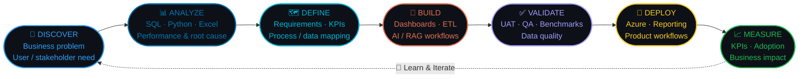

<div align="center">

```
███╗   ██╗ █████╗  ██████╗  █████╗      ██╗██╗   ██╗ ██████╗ ████████╗██╗  ██╗██╗
████╗  ██║██╔══██╗██╔════╝ ██╔══██╗     ██║╚██╗ ██╔╝██╔═══██╗╚══██╔══╝██║  ██║██║
██╔██╗ ██║███████║██║  ███╗███████║     ██║ ╚████╔╝ ██║   ██║   ██║   ███████║██║
██║╚██╗██║██╔══██║██║   ██║██╔══██║██   ██║  ╚██╔╝  ██║   ██║   ██║   ██╔══██║██║
██║ ╚████║██║  ██║╚██████╔╝██║  ██║╚█████╔╝   ██║   ╚██████╔╝   ██║   ██║  ██║██║
╚═╝  ╚═══╝╚═╝  ╚═╝ ╚═════╝ ╚═╝  ╚═╝ ╚════╝    ╚═╝    ╚═════╝    ╚═╝   ╚═╝  ╚═╝╚═╝
                          M Y S O R E   S A T H Y A N A R A Y A N A R A O
```

[](https://git.io/typing-svg)

<br/>

[](https://www.linkedin.com/in/njyothi)
[](mailto:njyothi3k@gmail.com)
[](https://github.com/jyothi233)
[](tel:+17169483634)


<br/>


</div>

---

<div align="center">

```
╔═══════════════════════════════════════════════════════════════════════════╗
║                                                                           ║
║   "I work where data, product, AI, and operations meet — turning          ║
║    complex problems into measurable decisions, workflows, and products."  ║
║                                                                           ║
║                                              — Nagajyothi MS              ║
╚═══════════════════════════════════════════════════════════════════════════╝
```

</div>

---

## ⚡ &nbsp; Who I Am — In Python

```python
nagajyothi = {
    "focus"        : [
        "Business & Data Analytics",
        "AI / RAG Solutions",
        "Product & Business Analysis",
        "Strategy & Operations",
    ],
    "experience"   : "3+ years across KPMG, AI solutions, analytics, and digital products",
    "education"    : "MS in Management Information Systems — University at Buffalo (3.8/4.0)",
    "superpower"   : "Turning ambiguous business and data problems into measurable, scalable solutions",
    "impact"       : {
        "operational_savings" : "$2M+",
        "billing_issues_found": "$8M",
        "manual_work_reduced" : "80%",
        "document_accuracy"   : "99.8%",
        "visibility_growth"   : "37%",
        "decision_speed"      : "45% faster",
        "data_scale"          : "5x growth supported",
    },
    "core_stack"   : {
        "analytics" : ["SQL", "Python", "Excel", "Alteryx", "Data Modeling"],
        "bi"        : ["Power BI", "Tableau", "Looker", "Google Analytics"],
        "ai"        : ["RAG", "Azure OpenAI", "Azure AI Search", "Embeddings", "Hybrid Search"],
        "cloud"     : ["Azure", "AWS", "GCP"],
        "enterprise": ["SAP", "Oracle", "SharePoint"],
        "delivery"  : ["Jira", "Confluence", "BPMN", "UAT", "Agile", "BRD/FRD"],
    },
    "status"       : "Open to Data, AI, Product, and Strategy & Operations opportunities",
}
```

---

## 🏆 &nbsp; Impact That Speaks Louder Than Job Titles

```
┌─────────────────────────────────────────────────────────────────────────────────┐
│                                                                                 │
│   💰 $2M+           🔎 $8M           ⚡ 80%          🤖 99.8%        📈 37%     │
│   Operational       Billing         Manual Work     Document        Online      │
│   Savings           Issues Found    Reduced         Accuracy        Growth      │
│                                                                                 │
│   🎯 5×             📊 45%          🚀 33%          👥 10+          ✅ 50/50   │
│   Data Growth       Faster          Faster          Analysts        Domain      │
│   Supported         Decisions       Insights        Mentored        Validation  │
│                                                                                 │
└─────────────────────────────────────────────────────────────────────────────────┘
```

---

## 🎯 &nbsp; Where I Create Value

<div align="center">

```
┌─────────────────────────────────────────────────────────────────────────────────────┐
│                                                                                     │
│   📊  BUSINESS & DATA ANALYTICS                                                      │
│   ──────────────────────────────────────────────────────────────────────────────    │
│   I use SQL, Python, Excel, Alteryx, Power BI, and Tableau to move from raw data     │
│   to business decisions. At KPMG, I analyzed 200K+ transactions, uncovered $8M      │
│   in billing discrepancies, and helped build analytics workflows at enterprise scale.│
│                                                                                     │
│   🤖  AI & INTELLIGENT AUTOMATION                                                    │
│   ──────────────────────────────────────────────────────────────────────────────    │
│   I build and evaluate practical AI workflows — document intelligence, RAG, hybrid   │
│   retrieval, source validation, and secure Azure deployment. My current work spans   │
│   3,374 project files, 26K+ knowledge records, and 99.8% extraction accuracy.        │
│                                                                                     │
│   🎯  PRODUCT & BUSINESS ANALYSIS                                                    │
│   ──────────────────────────────────────────────────────────────────────────────    │
│   I translate user and stakeholder needs into requirements, KPIs, user stories,      │
│   UAT plans, dashboards, and prioritized workflows. I have worked across Product,    │
│   Engineering, QA, and business teams on AI and digital-product initiatives.         │
│                                                                                     │
│   ⚙️  STRATEGY & OPERATIONS                                                         │
│   ──────────────────────────────────────────────────────────────────────────────    │
│   I diagnose bottlenecks, redesign processes, automate reporting, and establish      │
│   measurable operating rhythms. My work has reduced manual effort by 80%, improved   │
│   reporting cadence, and contributed to $2M+ in operational savings.                 │
│                                                                                     │
└─────────────────────────────────────────────────────────────────────────────────────┘
```

</div>

---

## 🤖 &nbsp; Current Role — AI Solutions Engineer

<div align="center">

`🏢 Control Infotech Inc` &nbsp;·&nbsp; `AI Solutions Engineer` &nbsp;·&nbsp; `Aug 2026 – Present`

**Document Intelligence · RAG · Azure AI · Enterprise Search**

</div>

| Challenge | What I Built | Outcome |
|:---|:---|:---:|
| Thousands of project files difficult to search and analyze | Document extraction, cleaning, chunking, and deduplication workflow | **3,374 files · 1,831 docs · 99.8% accuracy** |
| Enterprise knowledge retrieval needed quality validation | Python RAG workflow with embeddings, hybrid search, semantic matching, and source validation | **18 PASS · 2 PARTIAL · 0 FAIL** |
| AI solution required secure enterprise deployment | FastAPI + Azure OpenAI + Azure AI Search + SharePoint + Entra ID | **26K+ knowledge records** |
| Domain responses needed evidence-based testing | Structured benchmark and domain validation | **50/50 validation queries** |

---

## 💼 &nbsp; KPMG — Analytics at Enterprise Scale

<div align="center">

`🏢 KPMG Global Delivery Center` &nbsp;·&nbsp; `Business Data Analyst` &nbsp;·&nbsp; `Aug 2022 – May 2024`

**Big 4 · Enterprise Analytics · ETL · Reporting Automation**

</div>

| # | Business Problem | My Approach | Outcome |
|:---:|:---|:---|:---:|
| 1 | Data volume outgrew existing workflows | Scaled Azure data pipelines with SQL and Python | **5× data growth supported** |
| 2 | Reporting was slow and manual | Automated monthly-to-weekly reporting workflows | **80% ↓ manual effort · $2M+ savings** |
| 3 | Billing inconsistencies needed investigation | Analyzed 200K+ transactions using SQL, Excel, and Alteryx | **$8M identified** |
| 4 | Leadership lacked consistent KPI visibility | Built Power BI and Tableau dashboards across 4 regions | **45% faster decisions** |
| 5 | Insights took too long to reach stakeholders | Redesigned enterprise data-management workflows | **72 hrs → 48 hrs** |
| 6 | Analytics capability needed scaling | Mentored 10+ analysts in modeling, QA, visualization, and Azure Databricks | **40% ↑ productivity** |

---

## 💼 &nbsp; Additional Experience

### 🌐 Holiday Channel® | Business Analyst
**Jul 2026 | AI-Powered Travel Platform**

- Prioritized product improvements for a platform covering **1,000+ global holidays** using Google Analytics and stakeholder input across **4 functional groups**
- Led product discovery, requirements elicitation, data mapping, backlog refinement, and UAT across **4 core workflows**
- Defined and monitored **6+ product and operational KPIs** across conversion, adoption, engagement, funnel completion, UAT, and defect leakage

---

### 📈 Community Dreams Foundation | Business Analyst
**Oct 2025 – Jul 2026 | Digital Analytics · Process Improvement**

- Analyzed market, portfolio, and campaign performance while developing automated dashboards across **5 cross-functional teams**
- Increased online visibility by **37%** and reduced reporting time by **15%**
- Translated stakeholder needs into measurable dashboard and workflow improvements

---

### 🎓 Ruffalo Noel Levitz | Engagement Operations Ambassador
**University at Buffalo | Mar 2025 – May 2025**

- Led multi-channel outreach to **5,000+ alumni and donors** through RNL Engage
- Used audience segmentation and campaign metrics to increase participation by **15%**
- Maintained **98%+ accuracy** in high-volume gift processing and performance reporting

---

### 🔐 Legacy Guard | Product Management Apprenticeship
**University at Buffalo | Jan 2025 – May 2025**

- Translated user feedback into BRDs, FRDs, user stories, and future-state workflows
- Synthesized input from **30+ users** into product-quality insights
- Applied Agile testing, BPMN, and UAT to support a **95%+ UAT pass rate**

---

## 🛠️ &nbsp; Tech Stack — What I Actually Use

<div align="center">

**[ DATA & ANALYTICS ]**


**[ BUSINESS INTELLIGENCE ]**


**[ GENERATIVE AI & SEARCH ]**


**[ CLOUD & ENTERPRISE ]**


**[ PRODUCT & DELIVERY ]**


</div>

---

## 🔁 &nbsp; How I Work — From Ambiguity to Outcome


```mermaid
flowchart LR
    A(["🎯 DISCOVER\nBusiness problem\nUser / stakeholder need"]) --> B(["📊 ANALYZE\nSQL · Python · Excel\nPerformance & root cause"])
    B --> C(["🗺️ DEFINE\nRequirements · KPIs\nProcess / data mapping"])
    C --> D(["🔧 BUILD\nDashboards · ETL\nAI / RAG workflows"])
    D --> E(["✅ VALIDATE\nUAT · QA · Benchmarks\nData quality"])
    E --> F(["🚀 DEPLOY\nAzure · Reporting\nProduct workflows"])
    F --> G(["📈 MEASURE\nKPIs · Adoption\nBusiness impact"])
    G -.->|"🔁 Learn & Iterate"| A

    style A fill:#0d1117,color:#2E9EF7,stroke:#2E9EF7,stroke-width:2px
    style B fill:#0d1117,color:#0077b5,stroke:#0077b5,stroke-width:2px
    style C fill:#0d1117,color:#00b4d8,stroke:#00b4d8,stroke-width:2px
    style D fill:#0d1117,color:#e17055,stroke:#e17055,stroke-width:2px
    style E fill:#0d1117,color:#a29bfe,stroke:#a29bfe,stroke-width:2px
    style F fill:#0d1117,color:#f9ca24,stroke:#f9ca24,stroke-width:2px
    style G fill:#0d1117,color:#1db954,stroke:#1db954,stroke-width:2px
```

---

## 🧠 &nbsp; Core Competencies — Across Domains

<div align="center">

| 📊 Data & Analytics | 🤖 AI & Automation | 💼 Business Analysis | 🎯 Product | ⚙️ Strategy & Ops |
|:---|:---|:---|:---|:---|
| SQL & Python | RAG Workflows | Requirements Elicitation | Product Discovery | Process Improvement |
| Data Modeling | Azure OpenAI | BRD / FRD | KPI Development | Business Performance |
| Statistical Analysis | Azure AI Search | Gap Analysis | User Stories | Root Cause Analysis |
| ETL / Data Pipelines | Embeddings | BPMN / Process Mapping | Backlog Refinement | Workflow Automation |
| Data Quality | Hybrid Search | UAT / QA | Feature Prioritization | Operating Metrics |
| Power BI / Tableau | Prompt Engineering | Stakeholder Management | Product Analytics | Cross-functional Execution |
| Alteryx / Excel | FastAPI Integration | Agile / Scrum | User Research | Executive Reporting |

</div>

---

## 📁 &nbsp; Project Portfolio

> *Projects that show how I think across analytics, product, and AI — not just which tools I know.*

---

### 📊 **01 — COVID-19 Pandemic Data Analysis**


**What it is:** Analysis of 150M+ COVID-19 records across 200+ countries using SQL and Tableau to evaluate infection trends, mortality, vaccination progress, and geographic patterns.

**What it demonstrates:**
- Complex SQL analysis on large public datasets
- Data validation and trend analysis
- Tableau storytelling for decision-ready insights
- Ability to communicate technical findings clearly

**Stack:** `SQL` · `Tableau` · `Excel` · `Data Visualization` · `Statistical Analysis`

---

### 🍽️ **02 — NutriFlow: Smart Nutrition & Pantry Management**


**What it is:** End-to-end product concept for a smart nutrition and pantry-management application, using customer discovery, user journey mapping, and competitive analysis.

**What it demonstrates:**
- Product thinking from problem discovery through solution design
- User journey mapping and customer research
- Competitive analysis and market-opportunity assessment
- Translation of user needs into product features and workflows

**Impact:** **25% improvement in user alignment** · **30% market opportunity identified**

**Stack:** `Product Strategy` · `User Journey Mapping` · `Competitive Analysis` · `Requirements` · `Prototyping`

---

### 🤖 **03 — Enterprise RAG Knowledge Assistant**


**What it is:** Enterprise retrieval workflow combining document intelligence, embeddings, hybrid search, source validation, Azure OpenAI, and Azure AI Search.

**What it demonstrates:**
- Large-scale document processing and knowledge preparation
- RAG evaluation using benchmark and domain-validation queries
- Secure enterprise deployment patterns
- Ability to bridge AI engineering, analytics, and business requirements

**Impact:** **99.8% extraction accuracy** · **26K+ knowledge records** · **50/50 domain validation**

**Stack:** `Python` · `RAG` · `Azure OpenAI` · `Azure AI Search` · `FastAPI` · `Hybrid Search`

---

### 📈 **04 — Stock Portfolio Management System**


**What it is:** B2C investment platform combining Python, SQL, and Tableau for portfolio tracking, transaction management, returns analysis, and performance visualization.

**What it demonstrates:**
- Financial and transactional data analysis
- Database and data-model design
- Dashboarding for user-facing insights
- Analytical thinking applied to a product use case

**Stack:** `Python` · `SQL` · `Tableau` · `Pandas` · `Financial Analysis` · `Data Modeling`

---

## 🏅 &nbsp; Certifications

<div align="center">


</div>

---

## 🎓 &nbsp; Education

```
╔══════════════════════════════════════════════════════════════════════════════╗
║  🎓  MASTER OF SCIENCE IN MANAGEMENT INFORMATION SYSTEMS                   ║
║      University at Buffalo, SUNY  ·  Jul 2024 – Jun 2025                  ║
║      GPA: 3.8/4.0                                                          ║
║                                                                            ║
║      Coursework: Data Warehousing · Cloud Computing · Data Visualization  ║
║                  Gen AI · Applied AI · DBMS                                ║
╠══════════════════════════════════════════════════════════════════════════════╣
║  🎓  BACHELOR OF ENGINEERING IN COMPUTER SCIENCE                           ║
║      BNM Institute of Technology, VTU  ·  Jun 2018 – Jul 2022             ║
║                                                                            ║
║      Foundation in software engineering, algorithms, and databases        ║
╚══════════════════════════════════════════════════════════════════════════════╝
```

---

## 🌟 &nbsp; The Differentiator

```
┌──────────────────────────────────────┬──────────────────────────────────────────────┐
│   What I Bring                       │   Evidence                                   │
├──────────────────────────────────────┼──────────────────────────────────────────────┤
│  Enterprise analytics               │  200K+ transactions · $8M identified         │
│  Automation mindset                 │  80% manual effort reduced · $2M+ savings    │
│  Scalable data work                 │  5× growth · millions of daily records       │
│  AI implementation                  │  RAG · Azure OpenAI · 26K+ knowledge records │
│  AI quality mindset                 │  18 PASS · 2 PARTIAL · 0 FAIL               │
│  Product thinking                   │  KPIs · discovery · UAT · prioritization     │
│  Cross-functional execution         │  Product · Engineering · QA · Business       │
│  Visualization & storytelling       │  Power BI · Tableau · 45% faster decisions  │
│  Leadership                         │  10+ analysts mentored · 40% productivity ↑  │
└──────────────────────────────────────┴──────────────────────────────────────────────┘
```

---

## 📦 &nbsp; Artifacts I Can Deliver

```
  ◉  Data Analysis & Root Cause Reports             — findings tied to business action
  ◉  Executive Dashboards                           — Power BI · Tableau · KPI reporting
  ◉  ETL / Data Pipeline Workflows                  — scalable, validated, documented
  ◉  Data Quality & Validation Frameworks           — repeatable checks and auditability
  ◉  Business & Functional Requirements             — BRD · FRD · user stories
  ◉  Process Maps & Gap Analysis                    — current state vs. future state
  ◉  UAT Plans & Acceptance Criteria                — measurable validation
  ◉  Product KPI Frameworks                         — adoption · conversion · quality
  ◉  RAG Evaluation & Retrieval Workflows           — grounding · search · validation
  ◉  AI-enabled Enterprise Search                   — Azure OpenAI · Azure AI Search
  ◉  Operational Improvement Recommendations        — metrics before and after
```

---

## 📊 &nbsp; GitHub Stats

<div align="center">

### Contribution Streak


</div>

---

## 💡 &nbsp; What I'm Building Toward

```yaml
🎯 Current Focus:
  - Business and data analytics at enterprise scale
  - Practical GenAI and RAG applications
  - AI-enabled product and workflow automation
  - Product analytics and operational decision systems

📚 Deepening:
  - RAG evaluation and retrieval quality
  - Azure AI architecture and enterprise search
  - Advanced analytics and experimentation
  - Product metrics and AI-enabled operating workflows

🔮 Career Direction:
  - Solve high-impact business problems with data and AI
  - Build products and operating systems that teams actually adopt
  - Grow at the intersection of analytics, AI, product, and strategy
```

---

<div align="center">

```
╔═══════════════════════════════════════════════════════════════════════════╗
║                                                                           ║
║                 📬   LET'S CONNECT                                        ║
║                                                                           ║
║   Data gives me the signal. Product gives it direction.                   ║
║   AI and operations help turn it into scalable impact.                    ║
║                                                                           ║
╚═══════════════════════════════════════════════════════════════════════════╝
```

[](https://www.linkedin.com/in/njyothi)
&nbsp;
[](mailto:njyothi3k@gmail.com)
&nbsp;
[](tel:+17169483634)
&nbsp;
[](https://github.com/jyothi233)

<br/>

[+%C2%B7+CSPO%C2%AE+Certified;Data+Analytics+%C2%B7+AI+Solutions+%C2%B7+Product+%C2%B7+Strategy+%26+Operations;%242M%2B+saved+%C2%B7+%248M+identified+%C2%B7+99.8%25+document+accuracy)](https://git.io/typing-svg)

<br/>


</div>

---

<div align="center">

**⭐ If your team is solving hard data, AI, product, or operational problems, let's connect.**

<sub>Last Updated: October 2026 | Built by Nagajyothi MS</sub>

</div>
